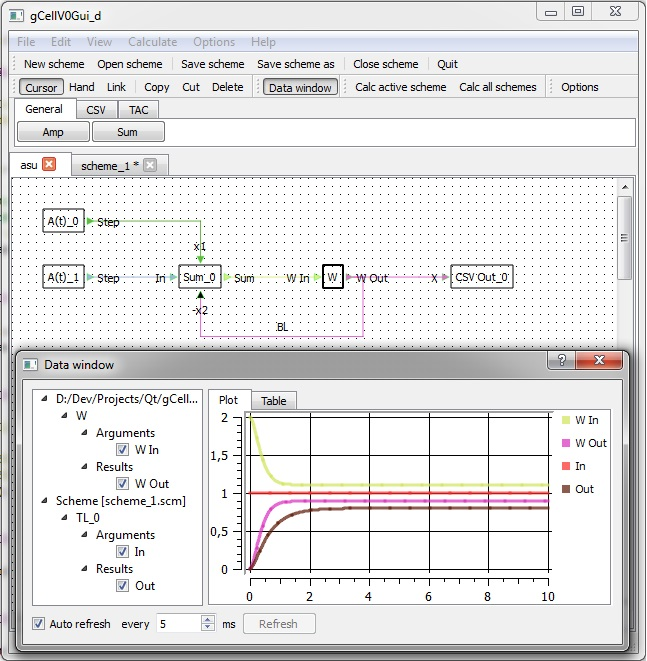

gCellV0
=======

Calculation algorithmic OrGraphs

Compil:

win32:
- cd {src_dir_path}\gcellv0
- qmake
- mingw32-make

required libraries:
- qwt plot 6.1.0 (http://qwt.sourceforge.net)

Now it looks like this:

